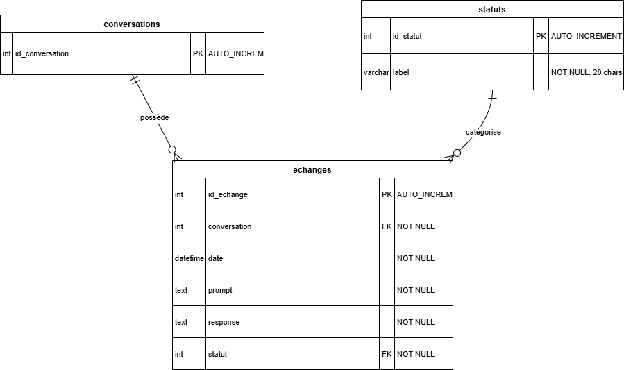

# Chatbot CGV – PoC Python

## 🧾 Présentation

Ce projet est un **Proof of Concept (POC)** académique développé dans le cadre de la formation *Développeur IA* à l'**ISEN/Simplon**. Il s’agit d’un **chatbot terminal** capable de répondre automatiquement aux questions liées aux **Conditions Générales de Vente (CGV)** d'une entreprise e-commerce fictive (*MonEshop*), en s'appuyant sur un modèle OpenAI **fine-tuné** à partir d’un fichier JSONL d’entraînement.

- **Nom du projet** : Chatbot CGV
- **Objectif** : Simuler un assistant interne répondant aux questions sur les CGV (paiement, rétractation, livraison, garantie, données personnelles)
- **Livrable** : MVP fonctionnant en **ligne de commande** (sans interface graphique)

## 🛠️ Fonctionnalités

- Chargement d’un pré-prompt métier.
- Utilisation d’un modèle fine-tuné via l’API OpenAI.
- Interaction utilisateur en console (prompt/réponse).
- Enregistrement des échanges dans une base SQLite (via Docker).

## 🧑‍💻 Stack technique

- **Python ≥ 3.12**
- **Ubuntu 24.04 (via WSL2 recommandé)**
- **Base de données SQLite** (conteneur Docker + Adminer pour visualisation)
- **API OpenAI** pour fine-tuning
- **VSCode** (avec environnement virtuel Python)
- **Fichier d’entraînement JSONL** pour affiner le modèle GPT

## ⚙️ Installation et préparation

### 1. Fork et clonage du projet

```bash
git clone https://github.com/TangiLC/isen01_chatbotcgv.git
cd chatbot-cgv
```

### 2. Création d’un environnement virtuel Python

Sous Linux (Ubuntu recommandé) :

```bash
python3 -m venv .venv
source .venv/bin/activate
```

### 3. Installation des dépendances

```bash
pip install -r requirements.txt
```

### 4. Configuration des variables d’environnement

Créer un fichier `.env` à la racine du projet :

```env
OPENAI_API_KEY=sk-xxxxxxxxxxxxxxxxxxxxxxxxxxxxxxxxxxxxxxxx
OPENAI_MODEL=gpt-4.1-nano-2025-04-14
OPENAI_FILE_ID=file-xxxxxxxxxxxxxxxxxxxxxxxxxxxxxxxx

```
un template existe `env.template`, il peut être copié et renommé en .env avec la commande :

```bash
cp env.template .env
```

Ces clés sont nécessaires pour utiliser le modèle fine-tuné via l’API OpenAI.

## 🧪 Lancement de l'application

```bash
python chatbot.py
```

Une interaction en console vous permettra de poser vos questions, et d’obtenir les réponses générées par le modèle.

## 🧬 Fine-tuning (optionnel, si vous ne disposez pas encore d’un modèle)

Les scripts suivants peuvent être utilisés **une seule fois**, pour uploader vos données d’entraînement et générer un modèle personnalisé :

```bash
# upload du fichier JSONL
python train/addfile.py

# lancement du fine-tuning
python train/finetuning.py
```

👉 N'oubliez pas de mettre à jour `OPENAI_FILE_ID` et le nom du modèle dans vos appels.

## 🧩 Structure du projet

```
chatbot-cgv/
├── chatbot.py              # Script principal d'interaction
├── .env                    # Fichier de configuration des clés
├── /train/
│   ├── addfile.py          # Script pour upload du fichier JSONL
│   └── train.jsonl         # Fichier jsonl de fine-tuning
├── /data/                  
│   ├── diag.png            # Schéma de la BDD
│   ├── docker-compose.yml  # fichier compose pour conteneuriser SQLite
│   └── script.sql          # Fichier sql de création de la BDD
├── finetuning.py           # Script de création du modèle fine-tuné
├── requirements.txt        # Liste des packages nécessaires
├── cgv.md                  # Conditions générales de ventes
├── organigramme.png        # Schéma de l'algorithme
└── README.md
```

# Diagramme de fonctionnement - chatbot.py

Ce diagramme est l'algorithme optimal visé, actuellement (PoC) les séquences de vérification en BDD et de gestion
d'erreur sont ignorées (*), l'ensemble des Question/Réponse est toujours stocké en BDD même en cas de doublon ou d'erreur.

```
┌────────────┐
│   Début    │      ┌──────────────┐
└────────────┴─────►│   Saisie     │
       ┌───────────►│ utilisateur  │
       │            └──────┬───────┘
       │   ┌───────────────▼─────────────┐
       │   │ La question existe-t-elle   │
       │   │ déjà en BDD (SQLite) ? *    │
       │   └─────┬─────────────┬─────────┘
       │       [oui*]        [non]
       │         │        ┌────▼────────────┐
       │         │        │ Envoi requête   │
       │         │        │ à l'API OpenAI  │
       │         │        └─────┬───────────┘
       │         │           ┌──▼───────────┐
       │         │           │ Attente de   │
       │         │           │ la réponse   │
       │         │           └──┬───────────┘
       │         │        ┌─────▼───────────┐
       │         │        │ Réponse de   *  │
       │         │        │ l'API valide?   ├─[non*]
       │         │        └────┬────────────┘   │
       │         │           [oui]              │
       │         │   ┌─────────▼────────────┐   │
       │         │   │ Stockage Q/R dans la │   │
       │         │   │ base de données      │   │
    [oui]        │   └─────────┬────────────┘   │
       │         └────────────►┤                │
      ┌┴──────────┐        ┌───▼────────┐       │
      │ Autre     │        │ Affichage  │◄──────┘
      │ question ?│◄───────┤ réponse *  │
      └────┬──────┘        └────────────┘
        [non]                              
      ┌────▼─────┐            
      │   Fin    │  
      └──────────┘                  
  
```


## 🐳 Base de données (SQLite via Docker)

Dans le dossier `/data`, exécutez :

```bash
docker-compose up -d
```

Puis accédez à Adminer via [http://localhost:8080](http://localhost:8080) pour visualiser les logs des interactions.
Le fichier `script.sql` permet de créer et peupler initialement la base SQLite Logs.


---

## 🛡️ RGPD <a href="https://www.cnil.fr/fr/reglement-europeen-protection-donnees">[CNIL]</a>

Dans la version PoC actuelle, des données sensibles utilisateurs entrées en prompt sont stockées en clair dans la BDD, sans consentement ni durée limitée. Avant la mise en production, des règles devront être suivies pour être en accord avec le RGPD :
- information utilisateur et demande de consentement
- stockage limité, chiffré, anonymisé...
- droit d'accès utilisateur, modification, suppression
- accès sécurisé à la BDD
- ... (le pré-traitement des prompts pourrait prendre en charge ces règles)

## 🎓 Projet pédagogique

- Travail réalisé en binôme (<a href="https://github.com/go2375" target="_blank">
  
</a>)
- Développement encadré pour du module *Fine-tuning GPT et prototypage IA* Prairie 01
- Formation ISEN - Simplon.co – 2025
- PS: les clés API OpenAPI initiales ont été révoquées, de nouvelles clés doivent être ajoutées au fichier .env

## License
Ce projet est sous licence [MIT](LICENSE).  
Vous êtes libre de l’utiliser, le modifier et le distribuer sous les conditions définies dans le fichier de licence.

## TO DO

- Création de fichier jsonl de fine tuning plus conséquent
- Conformité RGPD
- Reprise des commentaires des fonctions au format docstring
- nettoyage de la saisie utilisateur, prétraitement
- Gestion des doublons BDD et erreurs API
- factorisation et sécurisation, notamment bdd=mysql.connect()
- optimisation des exceptions, retry en cas d'echec etc...
- Front-end et annexes

---

**Bon développement !**
